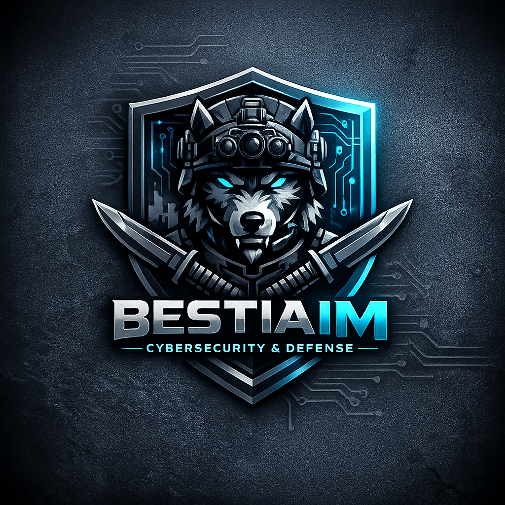
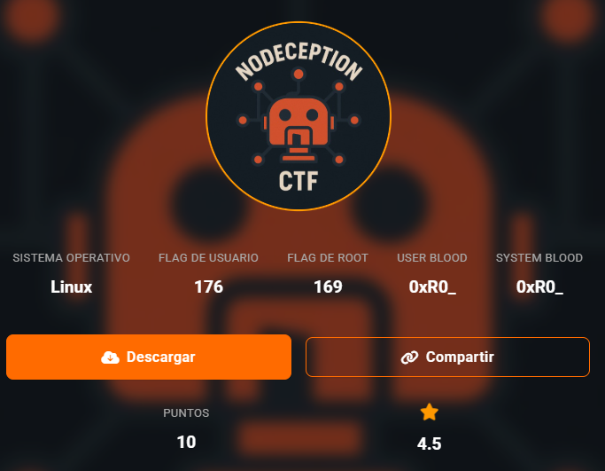
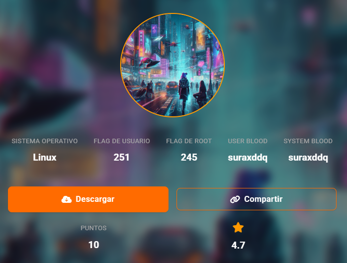

  

    

    <h1>SecNotes Bestiaim</h1>

    
Write-ups, apuntes e informes de laboratorios de ciberseguridad.

    

      Repositorio personal de documentación técnica, laboratorios de pentesting y notas de ciberseguridad.
       
      <a href="https://github.com/bestiaim/secnotes" target="_blank">Ver repositorio en GitHub</a>
    

  

  <h2 class="section-title">Máquinas resueltas</h2>

  

    

    

      <h2>
        <a href="maquinas/nodeception.html">NodeCeption - Pentesting Lab</a>
      </h2>

      

        Resolución paso a paso de la máquina vulnerable NodeCeption. El laboratorio incluye
        reconocimiento, escaneo de puertos, enumeración web, análisis de endpoints expuestos,
        explotación mediante abuso de una automatización en n8n y escalada de privilegios local hasta root.
      

      

        Linux
        n8n
        Web
        REST API
        Reverse Shell
        Privilege Escalation
      

      
Laboratorio académico · Write-up de pentesting

      

        <a class="btn-writeup" href="maquinas/nodeception.html">Ver write-up</a>
      

    

  

  

    

    

      <h2>
        <a href="maquinas/cyberpunk.html">Cyberpunk - Pentesting Lab</a>
      </h2>

      

        Resolución técnica de la máquina Cyberpunk. El proceso documenta FTP anónimo,
        exposición de archivos mediante Apache, carga de archivos al webroot, ejecución de PHP,
        obtención de shell inicial y escalada mediante Python Library Hijacking.
      

      

        Linux
        FTP
        Apache
        PHP
        Webroot Upload
        Python Hijacking
      

      
Laboratorio académico · Write-up de pentesting

      

        <a class="btn-writeup" href="maquinas/cyberpunk.html">Ver write-up</a>
      

    

  

  

    <strong>Aviso de uso:</strong> todo el contenido publicado corresponde a laboratorios controlados,
    máquinas vulnerables académicas o entornos autorizados. No se debe aplicar ninguna técnica descrita
    contra sistemas reales, redes de terceros o activos sin autorización explícita.
  

